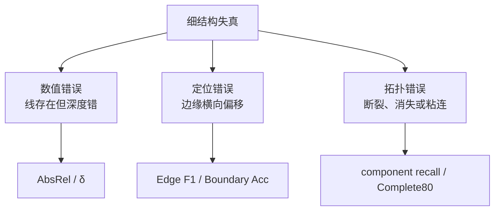

# 01. 问题定义与共同基础

[← 返回目录](README.md) · [下一章：InfiniDepth →](02-infinidepth.md)

## 1. 一句话定位

**细结构深度估计不是单纯提高二维分辨率，而是在尺度、相机、遮挡、多模态表面和离散采样共同约束下，恢复几何上正确且连续的窄结构。**

## 2. relative depth、metric depth 与 point map

### 2.1 三种常见输出

给定单张 RGB 图像 $I$：

- **relative depth** 只要求前后关系与形状正确，通常允许尺度 $s$ 甚至偏移 $t$：$D^*=s\hat D+t$；
- **metric depth** 要求 $D$ 具有米等物理单位，并能跨图像比较尺度；
- **point map** 对每个像素直接给出 $P(u)=(X,Y,Z)$，比单通道深度多表达了横向坐标与相机模型。

“输出 point map”不自动等于“几何一定透视一致”；反之，有已知内参的 z-depth 可以无损反投影成 point map。

### 2.2 内参与反投影

采用 OpenCV 相机坐标（$x$ 向右、$y$ 向下、$z$ 向前），

$$
K=
\begin{bmatrix}
f_x&0&c_x\\
0&f_y&c_y\\
0&0&1
\end{bmatrix}.
$$

像素 $u=(x,y)$ 和 z-depth $D(u)$ 对应

$$
P(u)=D(u)K^{-1}[x,y,1]^\top
=\left(
\frac{(x-c_x)D}{f_x},
\frac{(y-c_y)D}{f_y},
D
\right).
$$

因此，同一个深度边界在错误内参下会形成不同三维边界；评测 Boundary Acc/CD 时必须固定内参来源。若模型预测 normalized intrinsics，应先映射回当前图像尺寸再反投影。

## 3. 为什么深度常在 log、inverse 或 normalized 空间学习

### 3.1 深度、视差与 log-depth

三种常用标量为

$$
d=D,\qquad q=\frac{1}{D+\epsilon},\qquad \zeta=\log(D+\epsilon).
$$

远处一米误差和近处一米误差在安全意义上并不等价。inverse depth 放大近场差异；log-depth 把相对误差近似变成加性误差：

$$
\log \hat D-\log D=\log\frac{\hat D}{D}\approx\frac{\hat D-D}{D}.
$$

所以 PPD、PXDepth、MDA 的部分配置以及 MoGe-3 的 SSR 都在 log 或 normalized log 坐标工作，但它们的概率模型、训练目标和输出语义并不相同。

### 3.2 仿射对齐回答什么

相对深度常先求

$$
(s^*,t^*)=\arg\min_{s,t}\sum_{u\in M}
\rho\!\left(s\hat D(u)+t-D(u)\right),
$$

再评价 $s^*\hat D+t^*$。$\rho$ 可为平方误差、绝对误差或 robust loss；也可能在 disparity 或 $\log(1+D)$ 上对齐。不同空间的最优 $s,t$ 不相同。

对齐后的误差回答“预测形状在去除全局自由度后有多准”，不回答模型是否原生输出 metric scale。局部分割区域各自拟合尺度和平移又会进一步移除物体间相对位置，因此必须单列为 local shape 指标。

## 4. flying points 从哪里来

### 4.1 遮挡边界本来就是多表面问题

一个有限面积像素或重采样 footprint 可能同时覆盖前景 $d_f$ 与背景 $d_b$。若训练用单值回归，常见的平方误差最优解是条件均值：

$$
\hat d_{L_2}=\mathbb E[d\mid I,u].
$$

当条件分布近似

$$
p(d\mid I,u)=\pi\,\delta(d-d_f)+(1-\pi)\,\delta(d-d_b),
$$

均值 $\pi d_f+(1-\pi)d_b$ 往往不落在任何真实表面。它在二维图上可能只是一条一像素过渡带，反投影后却位于前景与背景之间，形成 flying points。

### 4.2 六种常见二维成因

1. 输入缩小使细线低于 Nyquist 采样极限；
2. patch embedding 在第一层就混合跨边界像素；
3. VAE/decoder 的 spatial bottleneck 平滑不连续面；
4. 单峰损失把多模态边界压成均值；
5. 上采样插值把前景、背景深度混合；
6. 有效区域、天空或透明区域标签不确定。

### 4.3 为什么二维锐利仍可能三维错误

若边界位置偏移一像素但前后深度差很大，预测图看起来仍锐利，错误点却落到另一表面。反之，深度数值很准但一根 1 px 电线中途断裂，区域平均 AbsRel 可能变化很小。因此“锐度、深度值、三维位置、连续性”必须分别测量。

## 5. 细结构误差的三类形态



文字解释：三个分支可能同时出现，但一个指标通常只能直接覆盖其中一部分。Boundary CD 兼顾三维边界的单向准确度与反向完整度，却仍不能可靠回答一根细线是否连续存活。

## 6. 全局、局部、边界与细结构指标

### 6.1 全局深度

有效像素集合为 $M$，则

$$
\mathrm{AbsRel}=\frac1{|M|}\sum_{u\in M}
\frac{|\hat D(u)-D(u)|}{D(u)},
$$

$$
\delta_1=\frac1{|M|}\sum_{u\in M}
\mathbf 1\!\left[
\max\left(\frac{\hat D(u)}{D(u)},\frac{D(u)}{\hat D(u)}\right)<1.25
\right].
$$

严格细结构也可报告 $\delta_{0.01}$、$\delta_{0.05}$ 等更紧阈值。全图均值会被大面积平坦区域主导，不能代替细线指标。

### 6.2 point-map 与局部三维形状

点图相对误差可写作

$$
\mathrm{Rel}_{P}=\frac1{|M|}\sum_{u\in M}
\frac{\|\hat P(u)-P(u)\|_2}{\|P(u)\|_2}.
$$

局部指标通常在每个分割区域 $R_j$ 内独立估计一个统一尺度和 XYZ 平移，再计算三维误差。它强调物体局部形状，却移除了区域之间的绝对位置，因此不能单独评价完整场景重建。

### 6.3 独立预测边缘

从预测深度自身提取边缘 $E_p$，从真值提取 $E_g$，在容差 $r$ 内匹配：

$$
P_r=\frac{|E_p\cap_r E_g|}{|E_p|},\qquad
R_r=\frac{|E_g\cap_r E_p|}{|E_g|},\qquad
F1_r=\frac{2P_rR_r}{P_r+R_r}.
$$

必须强调“独立预测边缘”：如果先用 GT mask 截取预测，再在其中评价，会把边界位置先验泄漏给指标。

### 6.4 窄宽度分层

先在 GT 细结构 mask 中做连通分量或 distance transform，以稳健直径代理把结构分为 $\le2$ px、2–4 px、4–8 px、$>8$ px，再在各层分别报告 AbsRel 和 $\delta$。宽度是栅格尺度代理，不是语义对象的真实物理直径。

### 6.5 连续性与完整恢复率

对 GT 细结构分量 $C_j$，令 $r_j$ 为在容差内被预测边缘覆盖的比例：

$$
r_j=\frac{|C_j\cap_r E_p|}{|C_j|},\qquad
\mathrm{Complete80}=\frac1J\sum_{j=1}^J\mathbf 1[r_j\ge0.8].
$$

分量平均 Recall 衡量平均保留量；Complete80 对“只找到一小段”的预测惩罚更强。

### 6.6 Boundary Acc 与 Boundary CD

将边缘像素反投影为预测集合 $B_p$ 和真值集合 $B_g$，常见定义为

$$
\mathrm{Acc}(B_p,B_g)=\frac1{|B_p|}\sum_{p\in B_p}\min_{q\in B_g}\|p-q\|_2,
$$

$$
\mathrm{Comp}(B_p,B_g)=\frac1{|B_g|}\sum_{q\in B_g}\min_{p\in B_p}\|q-p\|_2,
$$

$$
\mathrm{CD}=\frac{\mathrm{Acc}+\mathrm{Comp}}2.
$$

工作区 PXDepth 协议还会先以 point-to-point ICP 将预测边界刚体对齐到 GT。该指标依赖边缘提取、内参、有效 mask、深度对齐、ICP 和单位换算；不同实现下的毫米数不能直接混排。

## 7. 评测协议必须锁定的变量

| 维度 | 必须记录的内容 |
|---|---|
| 输入 | 原图尺寸、模型实际输入尺寸、保持长宽比方式、patch 对齐 |
| 输出 | 原生分辨率、插值方法、crop/pad 的逆变换 |
| 几何 | z-depth/ray distance/point map、内参来源、坐标系 |
| 对齐 | depth/disparity/log-depth，scale-only 或 scale-and-shift，robust 方法 |
| mask | valid、sky、透明区域、边界与局部分割来源 |
| 计算 | GPU、精度、warm-up、同步、是否含预处理/后处理/多步 refinement |
| 模型 | checkpoint、ViT-L/G、采样步数或 refinement steps |

## 8. 框架无关评测伪代码

```text
for sample in benchmark:
    rgb, gt_depth, intrinsics, valid = load(sample)
    pred = model(rgb)

    pred = undo_resize_crop_pad(pred, sample.geometry)
    pred_aligned = fit_allowed_alignment(pred.depth, gt_depth, valid)

    global_metrics.update(pred_aligned, gt_depth, valid)
    if sample.has_segments:
        local_shape_metrics.update(pred.points, sample.gt_points, segments)
    if sample.has_boundary_protocol:
        boundary_metrics.update(pred_aligned, gt_depth, intrinsics, valid)
    if sample.has_fine_structure_mask:
        width_metrics.update(pred_aligned, gt_depth, fine_mask)
        edge_metrics.update(edges(pred_aligned), edges(gt_depth), fine_roi)
        continuity_metrics.update(edges(pred_aligned), fine_components)
```

注意：伪代码先逆变换到同一图像坐标再算边缘；先插值 metric depth 还是 inverse/log depth 也会改变边界结果，应由协议明确决定。

## 9. 本章结论

细结构深度至少包含数值、边缘位置、三维几何和拓扑连续性四个目标。relative/metric、depth/point map、全局/局部对齐以及二维/三维边界指标回答不同问题。后续六章将持续使用这一统一坐标系，避免把视觉锐利等同于几何正确。

## 10. 与下一章的连接

如果问题首先来自离散输出网格——输入可很大，但网络只在固定格点预测再插值——自然的下一步是把深度写成可在任意连续坐标查询的函数。InfiniDepth正从这里开始。

[← 返回目录](README.md) · [下一章：InfiniDepth →](02-infinidepth.md)
