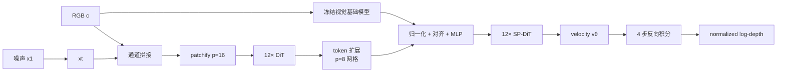

# 03. Pixel-Perfect Depth：像素空间条件生成

[← 上一章：InfiniDepth](02-infinidepth.md) · [返回目录](README.md) · [下一章：MDA →](04-mda.md)

## 1. 一句话定位

**PPD绕过深度 VAE，在单通道深度像素空间用 Flow Matching 从噪声生成 normalized log-depth，并用语义提示和 coarse-to-fine DiT 保住边界。**

论文：[Pixel-Perfect Depth with Semantics-Prompted Diffusion Transformers](https://arxiv.org/abs/2510.07316)；[项目页](https://pixel-perfect-depth.github.io/)。生成理论可补读[Flow Matching](../tutorial-generative-foundations/08-flow-matching.md)、[DiT](../tutorial-generative-foundations/07-dit.md)和[PixelDiT](../tutorial-generative-foundations/09-pixeldit.md)。

## 2. 问题动机：VAE 重建误差会成为几何下界

latent-depth 方法先把深度压到低分辨率 latent，再解码回像素。一个 latent cell 跨过前景/背景时，压缩、卷积与插值倾向产生中间深度，反投影后成为 flying points。

【论文报告】PPD 用真实深度通过 SD2 VAE-d4、SD3.5 VAE-d16 做 reconstruction 对照，观察到边界伪影。这证明被测 VAE 对几何边界不理想，不等于证明所有 autoencoder 在数学上必然失败。

## 3. 表示空间与完整数据流



PPD是像素空间条件生成模型，不是“输出恰好为像素图”的普通回归器。推理必须从随机噪声出发，多次评估 velocity 网络。

## 4. Flow Matching 的时间方向

PPD记 $x_0$ 为干净深度，$x_1\sim\mathcal N(0,I)$ 为噪声，

$$
x_t=(1-t)x_0+t x_1,
\qquad
v_t=\frac{dx_t}{dt}=x_1-x_0.
$$

网络学习

$$
\mathcal L_{\mathrm{vel}}
=\mathbb E\left[
\|v_\theta(x_t,t,c)-(x_1-x_0)\|_2^2
\right].
$$

训练路径的正方向是数据 $\to$ 噪声，但推理从 $t=1$ 积分到 $t=0$。Euler 更新为

$$
x_{t_{i-1}}=x_{t_i}+
(t_{i-1}-t_i)v_\theta(x_{t_i},t_i,c),
\qquad t_{i-1}<t_i.
$$

负步长使 $x_1-x_0$ 的方向反转，实际从噪声走向深度。把 target 符号单独拿出来判断生成方向会得出错误结论。

## 5. SP-DiT 与 Cascade DiT

### 5.1 Semantics-Prompted DiT

噪声很强时，$x_t$ 几乎不含场景布局。冻结视觉基础模型从干净 RGB 提取语义 token $e=f(c)$，先作

$$
\bar e_i=\frac{e_i}{\|e_i\|_2},
$$

再双线性对齐到 DiT token 网格并融合：

$$
z'=h_\phi\bigl(z\oplus\mathcal B(\bar e)\bigr).
$$

这里的 prompt 是空间视觉语义，不是文本提示。论文比较 DINOv2、VGGT、MAE、Depth Anything V2 等语义源，它们是替代项而非同时必需。

### 5.2 Cascade DiT

PPD-Large 的 24 个 block 先以 $p=16$ 运行 12 层，再做 token expansion，将网格从 $H/16\times W/16$ 变为 $H/8\times W/8$，后 12 层 SP-DiT 精修。它在网络深度方向永久增加 token 数；这与 PXDepth/PixelDiT 每个 block 中临时 compact-attend-expand 不是同一操作。

【分析判断】早期粗 token 更适合建立布局，后期细 token 更适合恢复边缘；这是架构动机，不是每层频率分工的定理。

## 6. 深度坐标、训练目标与张量变化

PPD先做

$$
\tilde d=\log(d+\epsilon),
$$

再按每图 2%/98% 分位数归一化：

$$
d_{norm}=\frac{\tilde d-q_{0.02}}{q_{0.98}-q_{0.02}}-0.5.
$$

主数据流为

```text
noisy depth x_t      [B, 1, H, W]
RGB condition c      [B, 3, H, W]
concat               [B, 4, H, W]
coarse DiT tokens    [B, HW/256, 1024]
fine SP-DiT tokens   [B, HW/64, 1024]
velocity             [B, 1, H, W]
```

总损失还加入多尺度 gradient matching：

$$
\mathcal L=\mathcal L_{\mathrm{vel}}
+\lambda_{grad}\sum_{s\in\mathcal S}
\|\nabla_s\hat x_0-\nabla_s x_0\|_1.
$$

论文没有公开足以逐行复刻所有梯度算子的官方代码，因此上式表达监督意图，不声称是源码等价实现。

## 7. 四步推理伪代码

```text
# training, PPD convention
x0 = normalize_log_depth(gt_depth)
x1 = normal_like(x0)
t  = uniform(0, 1)
xt = (1 - t) * x0 + t * x1

semantics = frozen_vision_encoder(rgb)
v_hat = cascade_sp_dit(concat(xt, rgb), t, semantics)
loss = mse(v_hat, x1 - x0) + gradient_regularization(...)
update(loss)
```

```text
# inference, four intervals
x = normal([B, 1, H, W])
semantics = frozen_vision_encoder(rgb)
times = [1.00, 0.75, 0.50, 0.25, 0.00]

for t_now, t_next in consecutive_pairs(times):
    velocity = cascade_sp_dit(concat(x, rgb), t_now, semantics)
    x = ode_step(x, velocity, t_now, t_next)

return inverse_normalized_log_depth(x)
```

## 8. 官方资料映射与复现边界

【论文/项目页事实】论文给出 SP-DiT、Cascade DiT、velocity/gradient 目标和四步结果。PXDepth 的对比协议使用 DA V2 语义条件的 PPD 变体与四个 sampling steps。

【资料边界】截至 2026-08-26，论文和项目页未确认一个可用于文件级映射的官方 GitHub 仓库。本章因此不虚构 Python 类名、checkpoint loader 或 sampler 接口。

【论文报告】附录在 RTX 4090、512×512、四步下报告 PPD-Large 约 140 ms、PPD-Small 约 40 ms。该数值不能与其他 GPU、输入面积或计时范围下的结果直接排序。

## 9. 主要消融、优势与失败模式

论文消融围绕 depth VAE reconstruction、语义 encoder、SP-DiT、级联分辨率与模型规模展开。核心证据链是：去除 VAE 取消重建瓶颈；语义提示稳定全局条件；后半段更密 token 提升细节。

**优势**：直接建模深度像素；生成轨迹可逐步纠正结构；语义与局部边界分别获得容量；四步已比常规扩散采样短。

**失败模式**：四次大网络评估仍贵；normalized relative depth 不直接提供 metric scale；随机初值与有限步 solver 引入方差/离散误差；pixel-space 不保证透明、反射与极细目标一定正确；训练和推理分辨率仍限制可见信息。

## 10. 本章结论与下一章连接

PPD在“像素生成空间”恢复细节，主要避开 latent VAE，并用 Flow Matching 表达整张深度分布。然而每个像素最终仍输出单值。下一章 MDA 会问：遮挡边界本来有多个合理表面时，为什么不显式保留多个假设？

[← 上一章：InfiniDepth](02-infinidepth.md) · [返回目录](README.md) · [下一章：MDA →](04-mda.md)
