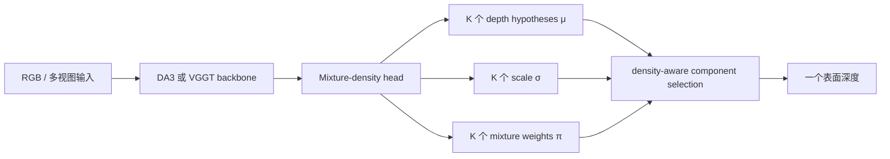

# 04. MDA：用混合密度表示边界歧义

[← 上一章：Pixel-Perfect Depth](03-pixel-perfect-depth.md) · [返回目录](README.md) · [下一章：PXDepth →](05-pxdepth.md)

## 1. 一句话定位

**MDA不强迫遮挡边界像素回归一个折中深度，而预测多个表面假设及其概率，并在推理时选择一个表面分量。**

论文：[Modeling Depth Ambiguity: A Mixture-Density Representation for Flying-Point-Free Depth Estimation](https://arxiv.org/abs/2606.02552)；[项目页](https://biansy000.github.io/mda-site/)；[官方代码](https://github.com/biansy000/MDA)。

## 2. 单值深度为什么结构性失败

遮挡边界的条件分布可同时在前景和背景有峰。若单值 $L_2$ 回归器输出条件均值，它可能位于两个峰之间；$L_1$ 的条件中位数在分布权重接近时也会不稳定跳变。MDA把每像素输出改成混合分布：

$$
p(z\mid I,u)=\sum_{k=1}^{K_{mix}}
\pi_k(u)\,p_k\bigl(z;\mu_k(u),\sigma_k(u)\bigr),
$$

其中 $z$ 默认取 log-depth，$\pi_k\ge0$ 且 $\sum_k\pi_k=1$。

## 3. 表示空间与完整数据流



MDA的重点不是换一个更大 backbone，而是修改最后的表示、训练似然和推理解码。官方 README 的默认实验用 $K_{mix}=4$，在 DA3-Giant 与 VGGT-1B 上验证。

## 4. Gaussian mixture 与 log-depth NLL

Gaussian 分量为

$$
p_k(z)=\frac{1}{\sqrt{2\pi}\sigma_k}
\exp\left[-\frac{(z-\mu_k)^2}{2\sigma_k^2}\right].
$$

对真值 $z^*=\log(D+\epsilon)$，负对数似然为

$$
\mathcal L_{NLL}(u)=
-\log\left[
\sum_{k=1}^{K_{mix}}
\pi_k(u)\,p_k(z^*(u))
\right].
$$

它允许某个分量拟合前景、另一个拟合背景，而不要求所有 $\mu_k$ 向均值坍缩。log-depth 使分量宽度更接近相对误差尺度。

【论文报告】默认 GMM 整体优于 Laplacian mixture（LMM）；这不是“Gaussian 永远正确”，而是其论文数据、loss 与 backbone 下的消融结论。

## 5. 推理为什么不能取 mixture mean

若直接输出

$$
\mathbb E[z]=\sum_k\pi_k\mu_k,
$$

就又可能落在两个表面之间，抵消多模态表示的意义。MDA会在候选假设处评价混合密度并选择一个 learned surface-valued hypothesis，可抽象为

$$
k^*=\arg\max_j p(z=\mu_j\mid I,u),
\qquad \hat z=\mu_{k^*}.
$$

精确代码会结合分量 confidence/scale；核心约束是**选择一个峰，而不是平均所有峰**。

## 6. 天空与透明物体扩展

### 6.1 独立天空分量

天空缺少有限表面深度。默认 DA3 MDA 配置加入固定大深度 sky component；当其 mixture weight 最大时输出天空语义，再在应用层把天空放到场景远处。它避免有限深度分量被迫解释天空。

### 6.2 多层透明深度

普通 softmax 强制各分量竞争并归一为 1。透明物体可能同时需要玻璃表面和其后背景，因此扩展模式把权重改为独立 sigmoid，并允许输出多个通过阈值的层。它说明 MDA 的“歧义”不只用于选一层，也可自然延伸为 multi-layer depth。

## 7. 张量变化、训练与推理伪代码

设 backbone head feature 为 $F\in\mathbb R^{B\times C\times H\times W}$：

```text
head outputs                  [B, H, W, K * parameter_groups]
means μ                       [B, H, W, K]
positive scales σ             [B, H, W, K]
softmax weights π             [B, H, W, K]
optional fixed sky component  [B, H, W, 1]
selected component index      [B, H, W]
depth                         [B, H, W]
```

```text
# training
features = frozen_or_finetuned_backbone(images)
mu, raw_scale, weight_logits = mixture_head(features)
sigma = positive(raw_scale) + eps
pi = softmax(weight_logits, dim=component)

z = log(gt_depth + eps)
log_prob = logsumexp(log(pi) + gaussian_log_prob(z, mu, sigma))
loss = -mean(log_prob[valid]) + auxiliary_geometry_losses(...)
update(selected_modules, loss)
```

```text
# inference
mu, sigma, pi = model(images)
density_at_candidates[j] = sum_k pi[k] * pdf(mu[j]; mu[k], sigma[k])
index = argmax_j(density_at_candidates[j])
depth = exp(gather(mu, index))

if sky_component_is_max(pi):
    mark_sky_or_assign_far_depth(depth)
```

## 8. 官方代码映射

- [`configs/experiment/mda/da3_mog_sky_full.yaml`](https://github.com/biansy000/MDA/blob/main/configs/experiment/mda/da3_mog_sky_full.yaml)：DA3 + GMM + sky 的训练 recipe、log-$L_2$ 类型和训练数据。
- [`src/training/da3_wrapper.py`](https://github.com/biansy000/MDA/blob/main/src/training/da3_wrapper.py)：`find_gmm_mode_gpu_chunk` 的单层分量选择、多层透明模式和 sky 后处理。
- [`src/testing/utils/model_choice.py`](https://github.com/biansy000/MDA/blob/main/src/testing/utils/model_choice.py)：默认 `mda_mog_sky_l2`、DA3-Giant 配置与 checkpoint 映射。
- [`src/depth_anything_3/model/dpt.py`](https://github.com/biansy000/MDA/blob/main/src/depth_anything_3/model/dpt.py)：DPT head 及输出分支。
- [`src/training/losses.py`](https://github.com/biansy000/MDA/blob/main/src/training/losses.py)：mixture likelihood 与辅助损失入口。

## 9. 实验、消融与复现边界

【论文报告】MDA在 NRGBD、7Scenes、HiRoom 等边界重建任务上显著降低 flying-point 相关误差，并在 DA3 与 VGGT 上显示 backbone-agnostic 性；DA3+MDA 约 33 FPS，新增 head 的运行开销很小。论文还比较 GMM/LMM、分量数、blur robustness、sky 与透明扩展。

【官方代码事实】公开 README 给出的训练为 10k steps、4×RTX Pro 6000、学习率 $10^{-4}$、总 batch 48；仓库具体默认配置可能已有演化，例如 YAML 中 optimizer 学习率、epoch/数据混合与论文摘要设置并非完全同一层级。复现必须记录使用的是论文表配置还是当前 release recipe。

【资料边界】本工作区没有 MDA 的 16 数据集或 Spring 同协议推理结果，因此本教程只引用其论文/官方代码，不把 PXDepth 论文里的 MDA baseline 数值伪装成本地实测。

## 10. 优势与失败模式

**优势**：直接针对边界多模态；只改 head 与 loss，易移植到强 backbone；选择峰能从机制上避免均值型 flying point；可扩展 sky 和透明多层。

**失败模式**：分量可能 mode collapse；有限 $K_{mix}$ 无法覆盖连续或复杂分布；候选均错误时选择机制无法修复；相邻像素独立选分量可能产生闪烁或不连续；非遮挡区域错误、相机误差和低分辨率采样并不由 mixture 表示自动解决。

## 11. 本章结论与下一章连接

MDA在“概率输出空间”恢复多个候选表面，专门处理单值深度的表示缺陷。下一章 PXDepth不显式建模分布，而是让全分辨率像素 feature 从输入到输出都保留下来，以一次前向恢复边界和连续细线。

[← 上一章：Pixel-Perfect Depth](03-pixel-perfect-depth.md) · [返回目录](README.md) · [下一章：PXDepth →](05-pxdepth.md)
