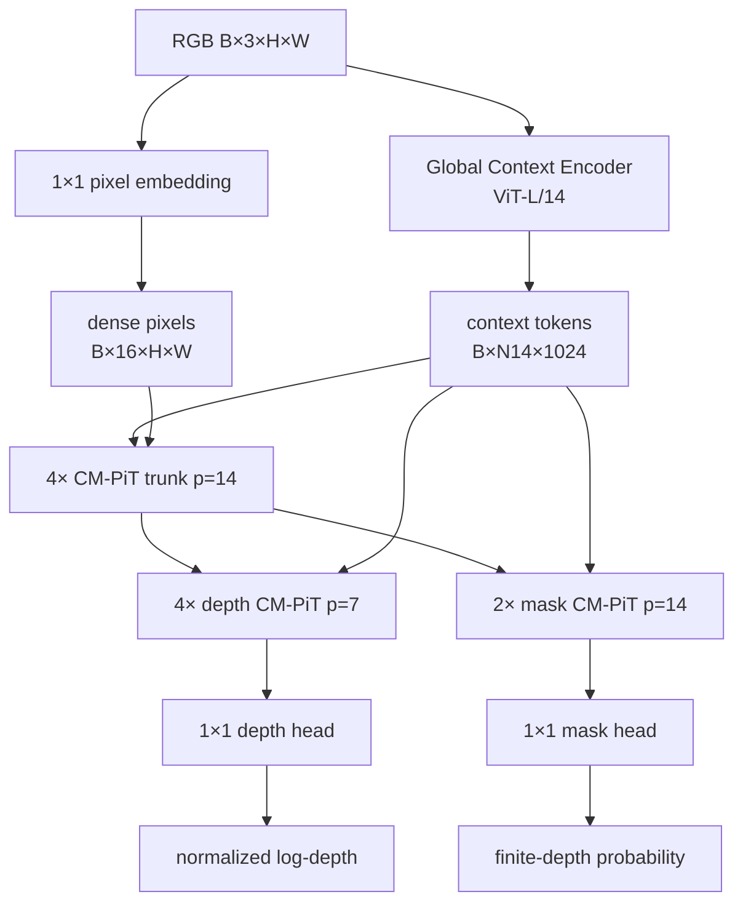

# 05. PXDepth：全分辨率像素特征中的单次前向深度

[← 上一章：MDA](04-mda.md) · [返回目录](README.md) · [下一章：MoGe-3 →](06-moge3.md)

## 1. 一句话定位

**PXDepth让 16 维 dense pixel feature 始终留在输入像素网格，用大模型 context 逐像素调制它，并在每个 CM-PiT block 中只临时压缩 attention token。**

论文：[PXDepth: Pixel-Space Modeling for Structure Preserving Monocular Depth Estimation](https://arxiv.org/abs/2608.16984)；[项目页](https://yuanzhy29.github.io/PXDepth-Page/)；[官方代码](https://github.com/yuanzhy29/PXDepth)。

## 2. 先划清范式边界

PXDepth是判别式、单次前向模型：

$$
C=E_{ctx}(I),\qquad
(\hat D,\hat M)=P_{pix}(I,C).
$$

它没有噪声 $x_t$、时间 $t$、velocity target 或 ODE solver。PPD提供“避开 depth VAE、全局语义提示像素空间、粗到细”的任务证据；PixelDiT提供逐像素调制与 compact-attend-expand 的 block 思想；PXDepth把它们改造成直接监督回归。详见旧教程的[PixelDiT](../tutorial-generative-foundations/09-pixeldit.md)和[生成式视角下的 PXDepth](../tutorial-generative-foundations/11-pxdepth.md)。

## 3. 完整数据流



主干先用四个 $p=14$ block 建立大范围结构，depth 分支再以四个 $p=7$ block 增加 attention token 密度；mask 分支用两个 $p=14$ block。这里 $p$ 是临时 compaction 的 patch size，不是把 dense residual 永久降采样。

## 4. Global Context Encoder

默认 context encoder 是 ViT-L/14，发布 checkpoint 从 MoGe-2 初始化。官方配置从层索引 $(5,11,17,23)$ 取 token，重排为空间 feature、投影到 1024 通道并求和：

$$
F_{ctx}=\sum_{k\in\{5,11,17,23\}}P_k(F_k)
\in\mathbb R^{B\times1024\times H/14\times W/14}.
$$

flatten 后

$$
C\in\mathbb R^{B\times N_{14}\times1024},
\quad N_{14}=\frac{HW}{14^2}.
$$

context 擅长场景布局、物体语义和有效区域；它不直接承担最终 $H\times W$ 深度解码，而是控制 pixel branch。

## 5. dense pixel stream 与 CM-PiT

### 5.1 像素嵌入

一个 $1\times1$ 卷积把 RGB 变成

$$
F^0_{pix}=\phi_{in}(I)
\in\mathbb R^{B\times16\times H\times W}.
$$

$1\times1$ 只混合同一像素的通道，不会在入口把前景与背景平均。所谓 pixel space 指主状态始终能映射回逐像素 feature，不等于 attention 从不分 patch。

### 5.2 compact-attend-expand

对一个 $p\times p$ 区域，将 16 维 pixel feature 临时展开并线性压成一个高维 token：

$$
T=\operatorname{Compress}_p(F_{pix})
\in\mathbb R^{B\times HW/p^2\times d_a},
$$

其中官方默认 attention dimension $d_a=1536$、24 heads。token 经 RMSNorm、attention 和 SwiGLU 后再线性展开：

$$
\Delta F=\operatorname{Expand}_p(T'),\qquad
F'_{pix}=F_{pix}+\Delta F.
$$

关键是 `Expand` 后与原 dense residual 相加；下一 block 又从 $F'_{pix}$ 重新 compact。若只保留 $T'$，模型就退化为普通 patch-token decoder，无法兑现逐像素主状态。

### 5.3 context-guided pixel-wise normalization

context token 经过投影与空间展开，为 dense pixel feature 生成位置相关的 scale、shift 和 residual/gate 参数。抽象写作

$$
\operatorname{AdaNorm}(F;C)
=\gamma(C)\odot\operatorname{Norm}(F)+\beta(C),
$$

并由 gate 控制 block 更新幅度。与一个全局 AdaLN 向量相比，$\gamma,β$ 随像素变化，能让“栏杆像素”和相邻背景接受不同调制。

## 6. 输出坐标与训练目标

深度 head 输出 normalized log-depth，mask head 输出有限深度概率。损失为

$$
\mathcal L_{depth}
=\frac1{|V|}\sum_{u\in V}|\hat d(u)-d_{norm}(u)|,
$$

$$
\mathcal L_{grad}
=\sum_{s\in\{1,2,4,8\}}
\frac1{|V_s|}\sum_{u\in V_s}
\left(|\nabla_xe_s(u)|+|\nabla_ye_s(u)|\right),
\quad e=\hat d-d_{norm},
$$

$$
\mathcal L_{mask}=\operatorname{BCE}(\hat M,M),
$$

$$
\mathcal L=1.0\mathcal L_{depth}
+0.5\mathcal L_{grad}+0.5\mathcal L_{mask}.
$$

normalized depth 恢复时需要每图尺度/偏移或评测对齐，因此它不是无条件 metric 输出。mask 分支把天空/无穷远/无效区域从有限深度中分离出来。

## 7. 张量变化与推理伪代码

```text
RGB                         [B, 3, H, W]
context feature             [B, 1024, H/14, W/14]
context tokens              [B, N14, 1024]
dense pixel feature         [B, 16, H, W]
p=14 attention tokens       [B, HW/196, 1536]
p=7 depth attention tokens  [B, HW/49, 1536]
normalized depth            [B, H, W]
mask probability            [B, H, W]
```

```text
function pxdepth(rgb):
    layers = vit_l14_intermediate(rgb, [5, 11, 17, 23])
    context = sum(project_1x1(x) for x in layers)
    context = flatten_tokens(context)

    pixels = project_1x1(normalize_rgb(rgb))
    pixels = cm_pit_stack(pixels, context, patch=14, blocks=4)

    depth_feature = cm_pit_stack(pixels, context, patch=7, blocks=4)
    mask_feature  = cm_pit_stack(pixels, context, patch=14, blocks=2)

    depth = depth_head(depth_feature)
    mask  = sigmoid(mask_head(mask_feature))
    return depth, mask
```

## 8. 官方代码映射

- [`pxdepth/model/PXDepth.py`](https://github.com/yuanzhy29/PXDepth/blob/main/pxdepth/model/PXDepth.py)：顶层 forward、depth/mask 返回值。
- [`pxdepth/model/Global_Context_Encoder.py`](https://github.com/yuanzhy29/PXDepth/blob/main/pxdepth/model/Global_Context_Encoder.py)：ViT-L/14、多层 feature 提取、1024 维 context。
- [`pxdepth/model/Pixel_Space_Depth_Predictor.py`](https://github.com/yuanzhy29/PXDepth/blob/main/pxdepth/model/Pixel_Space_Depth_Predictor.py)：16 维 pixel stream、4/4/2 blocks、14/7/14 patch 设置。
- [`pxdepth/model/CM_PiT.py`](https://github.com/yuanzhy29/PXDepth/blob/main/pxdepth/model/CM_PiT.py)：`ContextAdaNorm`、`CMPiTBlock`、linear compact/expand、RMSNorm 和 SwiGLU。

【官方代码事实】当前仓库提供 inference/evaluation；README 仍将训练代码标为待发布。因此 loss 和训练 recipe 可按论文理解，但无法声称已有完整官方训练流水线可逐行复现。

## 9. 论文结果与本地实测

【论文报告】发布论文在全局深度、local shape 与 Boundary Acc/CD 上对比 PPD、MDA、InfiniDepth 等，并在 RTX 5880、518×518 下报告约 56.4 ms。不同输入、GPU 和计时范围下不可直接横比。

【本地实测】工作区 16 数据集统一协议中，PXDepth 的等权平均为 Rel 5.823%、$\delta_1$ 94.058%；5 个局部分割数据集为 Local Rel 7.052%、Local $\delta_1$ 93.270%；5 个边界数据集为 Boundary Acc 66.623 mm、CD 80.704 mm。两张 H100 上记录的平均 forward 为 102.89 ms，但它不含与 MoGe-3 完全相同的后处理范围。

【本地实测】Spring 1000 帧中，PXDepth 的 coarse-mask AbsRel 为 22.3501%，弱于 MoGe-3 ViT-L 的 16.7151%；但 Edge F1@1 为 18.7479%，高于 15.0754%，优势主要来自 Recall。这支持“更容易保住边缘，但边缘上的深度值未必最准确”，不是“PXDepth在所有细节指标上最好”。详见[最终比较](08-comparison-metrics-and-selection.md)。

## 10. 优势、失败模式与复现边界

**优势**：一次前向；dense residual 保持逐像素线索；context 与 pixel 分工明确；临时 compaction 控制全分辨率 attention 成本；显式有效 mask。

**失败模式**：16 维 dense feature 仍有高分辨率显存/带宽成本；大 patch context 可能错过细小语义；relative normalized depth 需要对齐；透明/反射与极细纹理可能误判；单次回归不表达 MDA 式多个表面；公开训练代码尚不完整。

## 11. 本章结论与下一章连接

PXDepth在“像素 feature 空间”恢复细节，并用一次前向换取效率。它仍通过二维邻域传播信息；下一章 MoGe-3 会把当前 point map 体素化，让跨深度不连续面的相邻像素在稀疏三维卷积中分离。

[← 上一章：MDA](04-mda.md) · [返回目录](README.md) · [下一章：MoGe-3 →](06-moge3.md)
