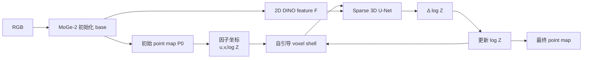

# 06. MoGe-3：自引导稀疏三维体素细化

[← 上一章：PXDepth](05-pxdepth.md) · [返回目录](README.md) · [下一章：2K Retrofit →](07-2k-retrofit.md)

## 1. 一句话定位

**MoGe-3先用 MoGe-2 式 base 预测 point map，再让当前几何自行定义稀疏体素壳，用 3D U-Net 反复预测 log-depth 残差。**

论文：[Fine-Detail Monocular Geometry Estimation with Self-Guided Sparse Volumetric Refinement](https://arxiv.org/abs/2607.17967)；[项目页](https://qft-333.github.io/moge3page/)；[官方代码](https://github.com/microsoft/MoGe)。

## 2. 问题动机：二维相邻不等于三维相邻

栏杆前景和远处墙面在图像上只差一像素，但三维距离很大。2D convolution、VAE decoder 或 UV-query decoder都按图像邻近聚合，容易跨深度不连续面传播 feature，使细杆变粗、扭曲或粘到背景。

MoGe-3的目标不是取消强 2D backbone，而是在后端加入 3D inductive bias：深度相差大的相邻像素落入不同体素，稀疏卷积不会直接把它们当同一局部表面。

## 3. 总体数据流



默认迭代三次。第 $k$ 次的输出决定第 $k+1$ 次体素拓扑，所以叫 self-guided；它不是在一个固定体素网格反复做相同卷积。

## 4. base model 与仿射 point-map 表示

base 输出 dense point map $P=(X,Y,Z)$、valid mask、normal 和 global metric scale，并预测/恢复内参。与 MoGe-2 一样，几何主监督允许光轴方向仿射自由度：

$$
(X,Y,Z)\mapsto(sX,sY,sZ+t),\qquad s>0.
$$

metric scale head 再把相对点图变到物理尺度。推理接口最终可返回 metric `points`、`depth`、normalized `intrinsics`、`mask` 和可选 `normal`。

## 5. 因子化坐标与自引导体素化

每个点改写为

$$
q_{ij}^{(k)}=(u_{ij},v_{ij},\zeta_{ij}^{(k)})
=\left(\frac{X_{ij}}{Z_{ij}},
\frac{Y_{ij}}{Z_{ij}},
\log Z_{ij}^{(k)}\right).
$$

$u,v$ 在 refinement 中固定，只更新 $\zeta$。深度分辨率为 $D_v$ 时，occupied coordinate 为

$$
c_{ij}^{(k)}=
\left(i,j,\operatorname{round}(D_v\zeta_{ij}^{(k)})\right).
$$

每个像素恰好对应一个 occupied voxel，形成 $HW$ 个点的薄壳，而不是填充整个 $H\times W\times Z$ 体积。两像素只有图像上接近且

$$
|\zeta_{ij}-\zeta_{i'j'}|\lesssim\frac1{D_v}
$$

时才在壳上邻接。log-depth 量化使相同比例的深度差获得相近 bin 距离，并对全局尺度乘法更稳定。

【官方代码事实】`v3.py` 在 fp32 中计算 `zq=round(logz*refiner_depth_resolution)`，逐 batch 减去最小 z bin，再构造 `(batch,i,j,z_idx)` int32 coordinate；输入 voxel feature 是 `(u,v,logz)`。fp32 是为避免细 log-depth bin 在 fp16 下合并或抖动。

## 6. Sparse 3D U-Net 与迭代更新

Sparse 3D U-Net只在 occupied voxels 上做残差块、下采样与上采样。最低分辨率处注入 base DINO 2D feature；同一图像位置但不同深度 voxel 可以复制同一 2D 语义，后续由 3D 邻域区分。

网络输出标量残差

$$
\Delta\zeta_{ij}^{(k)}=R_\phi
\left(\mathcal V^{(k)},F\right)_{ij},
$$

更新为

$$
q_{ij}^{(k+1)}=
\left(u_{ij},v_{ij},
\zeta_{ij}^{(k)}+\Delta\zeta_{ij}^{(k)}\right).
$$

最终欧氏点为

$$
P_{ij}^{(K)}=e^{\zeta_{ij}^{(K)}}(u_{ij},v_{ij},1).
$$

输出层零初始化，使训练开始时 SSR 是 identity mapping，避免随机 residual 立即破坏已有 base 几何。

## 7. 训练目标与两阶段训练

每一步（含初始 $k=0$）都有几何监督：

$$
\mathcal L_{geo}^{(k)}=
\mathcal L_{global}^{(k)}+
\mathcal L_{local}^{(k)}+
\mathcal L_{edge}^{(k)}.
$$

完整目标为

$$
\mathcal L=
\sum_{k=0}^{K}\mathcal L_{geo}^{(k)}
+\lambda_m\mathcal L_{mask}
+\lambda_n\mathcal L_{normal}
+\lambda_s\mathcal L_{scale}.
$$

【论文报告】warm-up 阶段阻断 base feature 到 refiner 的梯度，只让零初始化 SSR 学 residual；joint fine-tuning 再端到端训练。SSR只从像素精确的 synthetic 样本接收梯度，base model 使用 synthetic + real 混合数据。这避免不精确真实标签教坏锐利残差。

## 8. 张量变化与推理伪代码

```text
image                  [B, 3, H, W]
raw factorized coord   [B, h, w, 3] = (u, v, logz)
sparse features        [M, 3], M = B*h*w
sparse coordinates     [M, 4] = (batch, i, j, z_bin)
2D encoder feature     [B, C, h_e, w_e]
log-depth residual     [M, 1]
refined coord          [B, h, w, 3]
final point map        [B, H, W, 3]
```

```text
function moge3(image, refine_steps=3):
    q, feature_2d, mask, normal, metric_scale = base_model(image)

    predictions = [q]
    for step in range(refine_steps):
        feats, sparse_coords, sparse_shape, logz = voxelize_fp32(q)
        delta_logz = sparse_3d_unet(
            feats, sparse_coords, sparse_shape, feature_2d
        )
        q = concatenate(q[..., :2], logz + delta_logz)
        predictions.append(q)

    points = exp(q.logz) * concatenate(q.u, q.v, 1)
    depth, intrinsics = recover_projection_and_metric_scale(points, mask)
    return points, depth, intrinsics, mask, normal, predictions
```

## 9. 官方代码映射

- [`moge/model/v3.py`](https://github.com/microsoft/MoGe/blob/main/moge/model/v3.py)：`_voxelize`、`_refine_logz`、三步循环、`return_per_step` 和最终内参/metric 恢复。
- [`moge/model/modules/sparse_unet.py`](https://github.com/microsoft/MoGe/blob/main/moge/model/modules/sparse_unet.py)：`Sparse3DUNet`、2D bottleneck feature 注入、sparse encoder/decoder。
- [`moge/model/modules/flex_sparse_blocks.py`](https://github.com/microsoft/MoGe/blob/main/moge/model/modules/flex_sparse_blocks.py)：稀疏 residual、pool/down 与 nearest/up 操作。
- [`moge/model/v2.py`](https://github.com/microsoft/MoGe/blob/main/moge/model/v2.py)：继承的 base point-map、mask、normal、scale 与推理几何恢复。
- [`moge/scripts/infer.py`](https://github.com/microsoft/MoGe/blob/main/moge/scripts/infer.py)：`--resolution_level`、`--num_tokens`、`--refine_steps` 等用户入口。

官方提供约 370M 的 ViT-L 和 1.25B 的 ViT-G checkpoint；`infer(..., return_per_step=True)` 可导出初始值与每一步结果，适合检查 refinement 是否单调改善。

## 10. 实验、消融与本地实测

【论文报告】论文围绕 base/SSR、二维 vs 三维 refinement、log-depth voxelization、2D feature injection、迭代步数与 ViT-L/G 规模做消融。默认三步是质量与成本折中；更多步不是无条件单调收益。

【本地实测】16 数据集统一 PXDepth 协议：ViT-L Rel 5.214%、$\delta_1$ 94.811%，ViT-G 为 4.423%/95.987%；局部 shape 分别为 6.536%/94.011% 与 6.072%/94.448%。边界均值 ViT-L 为 71.729/84.661 mm，ViT-G 为 69.010/80.730 mm，并未在所有 Boundary 指标上胜过 PXDepth。

【本地实测】Spring 统一协议中，ViT-L 的 fine-mask AbsRel 16.7151%，优于 PXDepth 22.3501%，并在所有宽度层的 AbsRel 领先；但 Edge F1@1 与 Complete80 较低，说明“找回的细结构深度更准”与“细结构更连续”是两条轴。

记录时间为 ViT-L 130.98 ms、ViT-G 167.05 ms/样本；其范围包含 `model.infer()` 的深度/内参恢复与三次 SSR，PXDepth只计 forward，故只能作本机运行记录。

## 11. 优势、失败模式与复现边界

**优势**：直接优化 point-map 局部几何；跨深度边界的 feature 被体素拓扑分开；log-depth residual 具有比例尺度稳定性；metric scale、内参、mask、normal 能力完整；ViT-L/G 和步数可调。

**失败模式**：错误初始 point map 会构造错误 voxel neighborhood，self-guidance 可能自我强化；每步都要 voxelize 和运行 3D U-Net；固定 $u,v$ 主要修 depth，难直接校正横向对应错误；稀疏算子/Triton 部署门槛高；最细线在输入采样阶段消失后 SSR 无法凭空恢复。

## 12. 本章结论与下一章连接

MoGe-3在“稀疏三维空间”恢复细节，核心是让当前几何决定下一步邻域。下一章 2K Retrofit不改变基础模型内部几何表示，而是在 2K 图像上识别少量高熵像素，把额外计算只投到这些位置。

[← 上一章：PXDepth](05-pxdepth.md) · [返回目录](README.md) · [下一章：2K Retrofit →](07-2k-retrofit.md)
