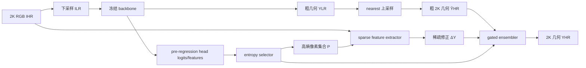

# 07. 2K Retrofit：熵引导的稀疏高分辨率细化

[← 上一章：MoGe-3](06-moge3.md) · [返回目录](README.md) · [下一章：比较、指标与选择 →](08-comparison-metrics-and-selection.md)

## 1. 一句话定位

**2K Retrofit冻结低分辨率几何 backbone，用 head feature 的熵选择约少量困难像素，只在 2K 原图上稀疏提取 feature 并门控融合。**

论文：[2K Retrofit: Entropy-Guided Efficient Sparse Refinement for High-Resolution 3D Geometry Prediction](https://arxiv.org/abs/2603.19964v3)。它是可挂接到深度或 point-map backbone 的增强框架，不是第七个独立基础深度模型。

## 2. 问题动机：2K 误差高度稀疏

直接把 foundation model 喂入 1440×1920 或更大图像，attention、dense feature 和显存成本迅速上升；把低分辨率预测直接插值则无法重建细杆、把手和边界。论文观察到 coarse 与高分辨率真值的主要差异集中在少量高频/高不确定区域，于是把问题改写为预算分配：

$$
\text{在 }|\mathcal P|\ll HW\text{ 的约束下，选择最值得细化的像素集合 }\mathcal P.
$$

## 3. 完整数据流



低分辨率长边示例为 256，粗几何用 nearest-neighbor 上采样，以免在这一步先人为创造跨边界的连续值。最终输出仍是 dense 2K map，但昂贵的 refinement 只发生在 active locations。

## 4. 熵选择：回归模型的熵从哪里来

标量 depth 没有类别分布，不能直接写 $-d\log d$。论文从最终 regression projection 之前的 head feature/logits 构造 $C$ 维 softmax：

$$
q_p(c)=\frac{\exp l_p(c)}{\sum_{j=1}^C\exp l_p(j)},
$$

$$
\mathcal H(p)=-\sum_{c=1}^Cq_p(c)\log q_p(c).
$$

选择

$$
\mathcal P=\{p\mid\mathcal H(p)>\alpha\},
$$

或等价地取 top-$r$ 高熵像素。熵衡量 head representation 的不确定/混合程度，不是严格校准的 depth posterior entropy。

【论文报告】top 10% 不确定像素可覆盖约 80% 高误差像素；熵 selector 在 RTX 4090 报告约 2.3 ms，learnable selector 约 4.0 ms。覆盖率依赖论文阈值、误差定义和 backbone，不应无条件外推。

## 5. sparse refinement 与 gated ensemble

选中像素分布不规则，论文用修改的 MinkowskiUNet 只在 active locations 计算：

$$
\Delta Y_p=\mathcal R(I^{HR}\mid p),
\qquad p\in\mathcal P.
$$

直接覆盖 coarse prediction 会丢失全局一致性，因此学习逐像素 gate：

$$
w_p=\sigma\left(
\operatorname{MLP}left[
\hat Y_p;\Delta Y_p;
\mathcal H(\hat Y_p);\mathcal H(\Delta Y_p)
\right]\right),
$$

$$
Y_p=f\left(w_p\hat Y_p+(1-w_p)\Delta Y_p\right).
$$

未选中位置保留 $\hat Y^{HR}$。$f$ 是任务相应输出映射。门控让低不确定区域更依赖全局 coarse，困难位置更多使用高分辨率修正。

## 6. 张量/坐标变化

```text
I_HR                    [B, 3, H, W]
I_LR                    [B, 3, h, w], h,w << H,W
Y_LR                    [B, C_geo, h, w]
nearest-upsample Y_hat  [B, C_geo, H, W]
head logits             [B, C, h, w]
entropy upsampled       [B, H, W]
active coordinates      [M, 3] = (batch, row, col), M≈rBHW
sparse HR feature       [M, C_r]
sparse correction       [M, C_geo]
final geometry          [B, C_geo, H, W]
```

单目深度时 $C_{geo}=1$；point map 时通常为 3。选择坐标必须精确映射 low-resolution head grid、2K RGB 与输出 map；半像素偏差会直接把 refinement 移到边界另一侧。

## 7. 训练与推理伪代码

```text
# training; the foundation backbone is frozen
with no_grad:
    head_feature, coarse_lr = backbone(downsample(image_hr))

coarse_hr = nearest_resize(coarse_lr, image_hr.shape)
entropy = entropy_from_pre_regression_feature(head_feature)
active = select_top_entropy(entropy, ratio=r)

delta = sparse_refiner(image_hr, active)
prediction = gated_fuse(coarse_hr, delta, entropy, active)
loss = base_model_task_loss(prediction, gt_geometry)
update(sparse_refiner, gate)  # not the backbone
```

```text
# inference
coarse_lr, head_feature = frozen_backbone(downsample(image_hr))
coarse_hr = nearest_resize(coarse_lr, [H, W])
active = entropy_select(head_feature, threshold_or_top_ratio)
delta = sparse_refiner(image_hr, active)
return gated_fuse(coarse_hr, delta, active)
```

“without backbone retraining”不等于整个系统无需训练：retrofit 的 sparse refiner 与 gate 仍需论文的 2K 数据训练。

## 8. 训练配置、实验与消融

【论文报告】作者用 NVIDIA Omniverse 构建 50K synthetic frames；retrofit 训练 13 epochs、batch 8，约一天/2×RTX A6000；延迟在单张 RTX 4090、FP16 测量。单目深度以冻结 Depth Anything V2 为 backbone，多视图 point map 以 VGGT 等为例。

论文在 ARKitScenes、ScanNet++ 和 ETH3D 测试。其表中 2K Retrofit 在 ETH3D 单目 depth 报告 AbsRel 0.0192、RMSE 0.0877、$\delta$ 0.9700、8.1 FPS；point-map 设置报告 Acc 0.935、Comp 0.602、Overall 0.839、5.5 FPS。数值属于其 2K 协议和具体 backbone，不能与本地 1022×770 PXDepth/MoGe-3 表直接排名。

关键消融应分别检查 selector（随机、误差幅值、learnable、entropy）、active ratio、sparse extractor、直接覆盖 vs gated fusion、输入分辨率和不同基础模型。active ratio 同时改变准确度、延迟和显存，不能只报告最终精度。

## 9. 官方资料映射与复现边界

【资料边界】论文明确写明 code will be released upon acceptance；截至 2026-08-26 未确认官方代码仓库。因此本章只提供论文级伪代码，不虚构包名、类名、配置字段或 checkpoint API。

完整复现目前缺少：head feature 的具体取层与归一化、MinkowskiUNet 结构细节、active coordinate 构造、任务 loss 的精确组合、各 backbone adapter 和训练数据生成脚本。即使能根据论文重写近似实现，也只能称第三方实现。

## 10. 优势与失败模式

**优势**：基础模型冻结且模型无关；全局 coarse 与局部 HR 修正职责清楚；计算量随 active ratio 而非全图像素增长；同时适配 depth 和 point map；适合 2K 输入。

**失败模式**：熵与真实误差可能错位，低熵但错误的区域不会被修；细线若在低分辨率 head feature 中完全消失，selector 可能看不到它；稀疏结果与 coarse 的坐标/尺度不一致会产生接缝；阈值需要跨域校准；部署依赖稀疏卷积；目前代码未发布。

## 11. 本章结论与下一章连接

2K Retrofit在“稀疏高分辨率区域”恢复细节：它不重做基础模型，而是学习哪里值得花 2K 计算。下一章把六种方法放入统一坐标，结合本地 PXDepth–MoGe-3 结果说明为什么全局深度、边缘连续性、三维边界与部署成本必须分开选择。

[← 上一章：MoGe-3](06-moge3.md) · [返回目录](README.md) · [下一章：比较、指标与选择 →](08-comparison-metrics-and-selection.md)
