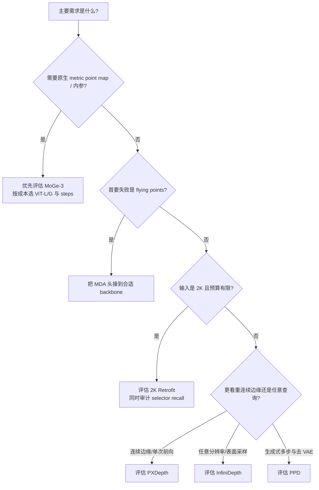

# 08. 六方法比较、指标与场景选择

[← 上一章：2K Retrofit](07-2k-retrofit.md) · [返回目录](README.md)

## 1. 先给出统一结论

六种方法不是一条可用单个分数排序的队列，而是对六个不同瓶颈的干预：

| 方法 | 主要修复层 | 最直接解决的问题 | 没有直接解决的问题 |
|---|---|---|---|
| InfiniDepth | 连续隐式场 | 固定输出网格、任意分辨率查询 | 多模态边界、原生 RGB-only metric scale |
| PPD | 像素生成空间 | depth VAE 的边界重建瓶颈 | 单值输出、多步推理成本 |
| MDA | 概率分布 | 边界单峰/均值造成 flying points | 输入采样不足、全图高分辨率 |
| PXDepth | dense pixel feature | patch decoder 丢失逐像素线索 | 多表面概率、三维邻域、原生 metric scale |
| MoGe-3 | 稀疏三维体素壳 | 二维相邻导致跨深度表面混合 | 错误初始拓扑、2K dense 输入成本 |
| 2K Retrofit | 稀疏 HR 像素集合 | 2K 全图 dense 计算过贵 | selector 未选中的低熵错误、独立基础预测 |

所以“目前最好的 pixel-level 深度思路”更准确地应表述为：**先用强 foundation backbone 保证全局几何，再根据失败类型选择连续查询、像素空间、混合密度、稀疏 3D 或稀疏 2K refinement。**

## 2. 统一能力矩阵

| 维度 | InfiniDepth | PPD | MDA | PXDepth | MoGe-3 | 2K Retrofit |
|---|---|---|---|---|---|---|
| 主输出 | relative depth；另有 sensor 模式 | relative normalized log-depth | 随 DA3/VGGT | normalized relative depth + mask | metric point/depth + K + mask + normal | 随基础模型 |
| 主状态 | 连续 UV 条件函数 | noisy depth pixels | 每像素 mixture | $H\times W$ pixel feature | $(i,j,\mathrm{bin}(\log Z))$ sparse shell | active HR pixels |
| 推理迭代 | 编码 1 次，query 可分块 | 默认 4 个 solver intervals | backbone 1 次 + 分量选择 | 1 次前向 | base + 默认 3 次 SSR | LR backbone + 1 次 sparse refinement |
| 任意输出尺寸 | 原生 query 能力 | 受模型/patch 设置影响 | 受 backbone 影响 | 受 patch divisibility 与显存影响 | 输出回原图，计算 token 数可调 | 目标即 2K retrofit |
| metric scale | RGB-only 否；sensor/额外对齐可支持 | 否 | 随 backbone/config | 否 | 是 | 随 backbone |
| 内参 | 点云流程需给定/估计 | 不主打 | 随 backbone | 不输出 | 输出/恢复 normalized K | 随 backbone |
| valid/sky | 可配 sky segmentation | 论文流程为深度生成 | 独立 sky component | 显式 mask branch | 显式 valid mask | 随 backbone/adapter |
| 细节主要来自 | 连续局部查询 | 去 VAE + 生成式粗到细 | 多峰选择 | dense residual + CM-PiT | 3D locality + residual iteration | entropy-selected HR feature |
| 官方训练代码 | 已公开 | 未确认 | 已公开 | 尚未完整公开 | 已公开 | 未公开 |

`K` 在 MoGe-3 列指相机内参，不是 MDA 的混合分量数。

## 3. 论文结果不能直接混排

以下数字只用于理解每篇论文的计算量级，**不是公平速度榜**：

| 来源 | 论文记录的上下文 | 为什么不可直接比较 |
|---|---|---|
| PPD | 512×512、RTX 4090、4 steps；Large 约 140 ms、Small 约 40 ms | 两种模型规模；多次网络评估 |
| MDA | DA3+MDA 约 33 FPS，head 额外开销很小 | backbone、多视图/单目与完整管线口径需随表核对 |
| PXDepth | 518×518、RTX 5880，约 56.4 ms | 单次 forward；GPU 与本地不同 |
| MoGe-3 | 官方 API 默认 3 refine steps，ViT-L/G 规模不同 | token 数、是否含几何恢复显著影响时间 |
| 2K Retrofit | 2K、RTX 4090、FP16；ETH3D depth 表为 8.1 FPS | 输入面积远大于 512；含 sparse branch |
| InfiniDepth | 编码一次，解码与 query 数近似线性 | 任意输出分辨率导致 $N$ 不固定 |

同理，InfiniDepth 的 Synth4K、MDA 的 boundary benchmark、PPD/PXDepth 的论文表、MoGe-3 的 local shape 和 2K Retrofit 的 ARKitScenes/ScanNet++/ETH3D 都有不同对齐、mask 与输入设置。只能在各自论文内部读消融，不能拼成一个跨论文名次。

## 4. 工作区 16 数据集：PXDepth 与 MoGe-3 的同协议比较

【本地实测】MoGe-3 与 PXDepth 使用相同的 16 个数据集和样本索引、PXDepth 数据变换、1022×770 等面积输入、FP16、PXDepth log-depth affine 对齐与指标实现；MoGe-3 使用 3 次 SSR。

### 4.1 全局深度

| 模型 | Rel ↓ | $\delta_1$ ↑ |
|---|---:|---:|
| PXDepth | 5.823% | 94.058% |
| MoGe-3 ViT-L | 5.214% | 94.811% |
| MoGe-3 ViT-G | 4.423% | 95.987% |

这组结果说明同协议下 MoGe-3 尤其 ViT-G 的对齐后全局深度更准；它没有回答 edge recall 或运行成本是否更合适。

### 4.2 局部三维形状

只在 ETH3D、iBims-1、Sintel、DDAD、DIODE 的分割区域内独立拟合统一尺度和 XYZ 平移：

| 模型 | Local Rel ↓ | Local $\delta_1$ ↑ |
|---|---:|---:|
| PXDepth | 7.052% | 93.270% |
| MoGe-3 ViT-L | 6.536% | 94.011% |
| MoGe-3 ViT-G | 6.072% | 94.448% |

该表支持 MoGe-3 的 local shape 优势，但区域独立对齐移除了物体间相对位置，不能代替 metric scene reconstruction。

### 4.3 三维边界

5 个有对应协议的数据集，预测边界 point cloud 先 point-to-point ICP 对齐：

| 模型 | Boundary Acc ↓ | Boundary CD ↓ |
|---|---:|---:|
| PXDepth | 66.623 mm | 80.704 mm |
| MoGe-3 ViT-L | 71.729 mm | 84.661 mm |
| MoGe-3 ViT-G | 69.010 mm | 80.730 mm |

PXDepth 的平均 Acc 最低，CD 与 ViT-G 几乎相同。这揭示全局/局部深度领先不保证 Boundary Acc 也领先；边界集合、ICP 和完整度会改变排序。

### 4.4 本机时间记录

| 模型 | 记录值 ms/样本 |
|---|---:|
| PXDepth | 102.89 |
| MoGe-3 ViT-L | 130.98 |
| MoGe-3 ViT-G | 167.05 |

PXDepth只计 model forward；MoGe-3 的 `model.infer()` 含三次 SSR、深度/内参恢复。该表不能解释为严格 kernel latency 比较，只能证明本地完整调用范围与成本不同。

## 5. Spring 1000 帧：深度值与边缘连续性的分离

【本地实测】Spring 细结构评测统一使用 1176×672 输入、FP16 和 MoGe-3 ViT-L 三步 refinement；两者使用同一 robust `log1p-depth` affine alignment。公开 Spring 包缺少 MoGe-3 论文所需 SAM2 masks，因此本地 coarse mask 不能冒充论文 local protocol。

### 5.1 细结构深度数值

| 指标 | PXDepth | MoGe-3 ViT-L |
|---|---:|---:|
| coarse-mask AbsRel ↓ | 22.3501% | 16.7151% |
| $\delta_{0.01}$ ↑ | 8.4994% | 12.8709% |
| $\delta_{0.05}$ ↑ | 34.5957% | 44.8868% |
| $\delta_1$ ↑ | 68.1699% | 77.6277% |

MoGe-3 还在 $\le2$、2–4、4–8、$>8$ px 四个宽度层的 AbsRel 全部更低。

### 5.2 边缘与连续存活

| 指标 | PXDepth | MoGe-3 ViT-L |
|---|---:|---:|
| Precision@1 ↑ | 40.4861% | 40.1162% |
| Recall@1 ↑ | 14.1261% | 10.3214% |
| Edge F1@1 ↑ | 18.7479% | 15.0754% |
| Edge F1@3 ↑ | 23.3365% | 20.1413% |
| component mean Recall@1 ↑ | 7.2269% | 5.1581% |
| Complete80@1 ↑ | 4.6726% | 3.0038% |

Precision 接近，PXDepth 的 F1 优势主要来自 Recall。最稳妥的解释是：**MoGe-3 对恢复出的细结构给出更准确深度，PXDepth让更多细边缘连续存在。** Boundary CD 单独无法表达这种差异。

## 6. 推荐的细结构指标组

不要生成总分，固定报告四组互补指标：

1. **窄结构深度**：$\le2$ px、2–4 px 的 AbsRel、$\delta_{0.01}$、$\delta_{0.05}$；
2. **独立边缘定位**：Precision、Recall、F1@1，F1@3 作为对重采样误差更宽松版本；
3. **连续性**：component mean Recall 与 Complete80；
4. **三维边界**：Boundary Acc/CD，并完整记录内参、ICP、mask、单位和边缘算子。

全局 Rel/$\delta_1$、local point shape、metric scale 和 invalid/sky 能力作为另外四条独立轴。任何单项最好都不能推导“综合最好”。

## 7. 常见误区

- **像素对齐 = pixel-space modeling**：错误。插值后的 $H\times W$ 深度也像素对齐，但主表示可能仍在低分辨率 latent。
- **arbitrary resolution = 新细节无限生成**：错误。InfiniDepth解除查询网格限制，不解除输入和 feature 的信息限制。
- **pixel-space = flying-point-free**：错误。PPD/PXDepth避开某些平滑瓶颈，单值歧义仍可能存在；MDA直接处理多峰。
- **3D refinement = 所有边缘更完整**：错误。本地 Spring 中 MoGe-3 数值更准但 edge recall 更低。
- **metric point map = 无需内参检查**：错误。推理过程仍有投影/内参恢复，输出坐标约定会影响下游。
- **2K output = 模型全程 2K dense inference**：错误。2K Retrofit的核心恰是 low-res coarse + sparse HR。
- **论文 FPS 可横排**：错误。GPU、分辨率、steps、预后处理和同步范围不同。

## 8. 按场景选择

### 8.1 普通零样本深度

- 需要 metric depth、内参与 point map 的完整产品接口：先评估 MoGe-3 ViT-L；质量预算充足再测试 ViT-G。
- 只需 relative depth、重视单次前向和清晰边缘：PXDepth是更直接的候选。
- 不应仅依据本文本地表选择，目标域必须复测 scale、sky、反射与吞吐。

### 8.2 细线、栏杆、电线、树枝

- 目标是“线不能断”：优先用独立 Edge Recall/F1 与 Complete80筛选，当前 Spring 证据更支持 PXDepth 的连续保留。
- 目标是“线上每个点的三维深度要准”：当前 Spring 的窄宽度 AbsRel 更支持 MoGe-3。
- 输入本身为 2K：2K Retrofit的 sparse HR 机制与 InfiniDepth的高密 query 都值得实验，但目前没有与本地两模型的同协议结果。

### 8.3 低 flying-point 点云

如果主要伪影来自遮挡边界的中间深度，MDA的多峰表示最直接；若还需要 point-map local shape，可将其思路与 DA3/VGGT 级 backbone结合。PPD/PXDepth的清晰像素边缘是有价值但不同的机制证据。

### 8.4 高保真三维结构

MoGe-3直接在 sparse 3D shell 聚合，并原生输出 metric point map/内参/mask，最贴近此接口需求。部署前必须检查初始几何错误是否被 SSR 放大、三步收益、稀疏算子兼容性和显存。

### 8.5 2K 图像

2K Retrofit最明确地把计算预算设计为 sparse HR refinement；InfiniDepth适合需要任意坐标/表面均匀采样的研究管线。PXDepth和 MoGe-3也可提高输入/token 数，但 dense feature 或 base token 成本不同，不能因为输出可 resize 就称“2K 高效”。

### 8.6 实时或端侧

这六种方法没有一个可仅凭论文直接判定为端侧方案。PXDepth是单次前向但含 ViT-L/14；MDA head 开销小但整体仍取决于 DA3/VGGT；MoGe-3有三次稀疏 3D refinement；PPD有四步生成；InfiniDepth成本随 query 数；2K Retrofit依赖稀疏卷积。端侧决策需要在目标加速器上测算子支持、峰值显存、功耗和 end-to-end latency，而不是换算论文 FPS。

## 9. 源码阅读入口

| 方法 | 建议顺序 |
|---|---|
| InfiniDepth | `inference_depth.py` → `InfiniDepth/model/model.py` → `implicit_decoder.py` → training model |
| PPD | 论文 § Flow Matching → SP-DiT → Cascade DiT → appendix；当前无文件级官方映射 |
| MDA | `model_choice.py` → DA3/VGGT wrapper → GMM mode selection → losses/config |
| PXDepth | `PXDepth.py` → Global Context Encoder → Pixel Predictor → CM-PiT |
| MoGe-3 | `moge/model/v3.py` → `sparse_unet.py` → sparse blocks → `v2.py` |
| 2K Retrofit | 论文 §3.2/3.3 → selector/active ratio/gate ablation；等待官方代码 |

上述汇总包括 PXDepth 的独立复现，以及 PXDepth 与 MoGe-3 在 16 个数据集和 Spring 上的同协议比较；解读时应保留各自的输入、对齐、mask 与运行范围约束。

## 10. 最终结论

细结构单目深度的前沿演化可以概括为：

$$
\text{离散网格}
\rightarrow\text{连续查询},\quad
\text{latent}
\rightarrow\text{depth pixels},\quad
\text{单值}
\rightarrow\text{多峰分布},
$$

$$
\text{patch token}
\rightarrow\text{dense pixel feature},\quad
\text{2D 邻域}
\rightarrow\text{sparse 3D 邻域},\quad
\text{dense 2K}
\rightarrow\text{sparse HR refinement}.
$$

六种方法最重要的共同启示不是“把分辨率拉高”，而是让计算发生在与错误机制匹配的表示空间。实际选型应先确定需要的是相对还是 metric、深度还是 point map、数值准确还是连续存活，再用同一目标域协议验证。

[← 上一章：2K Retrofit](07-2k-retrofit.md) · [返回目录](README.md)
