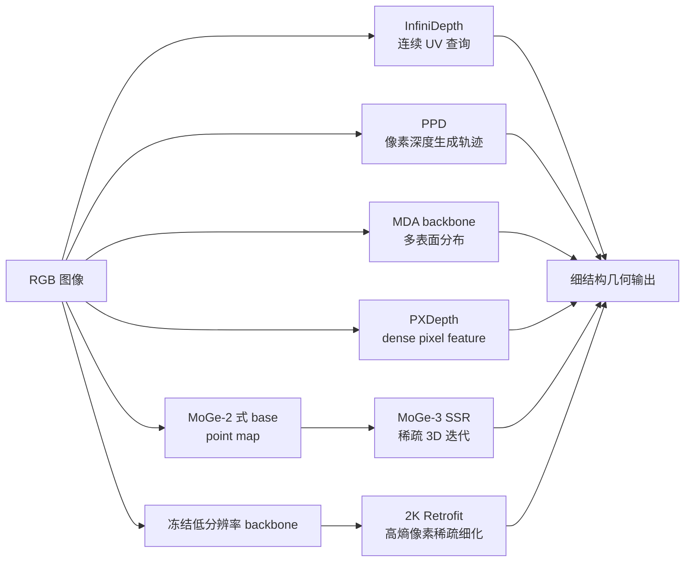

# 细结构单目深度估计：六种方法的统一知识链

> 资料核对日期：2026-08-26。本文档集讨论论文与公开实现截至该日期的状态；后续仓库更新可能改变代码入口、权重和复现结论。

[开始阅读：问题与基础](01-problem-and-foundations.md) · [最终比较与选型](08-comparison-metrics-and-selection.md) · [生成式建模基础链](../tutorial-generative-foundations/README.md)

## 1. 本教程要回答什么

单目深度的“细节好”至少有四种不同含义：输出与输入像素一一对齐、直接在深度像素空间建模、在三维空间修正几何、以及只在高分辨率困难区域追加计算。它们不能互相替换。

本教程围绕六种方法追问同一个问题：**模型在哪一个表示层恢复被低分辨率、单值回归或二维解码损坏的细结构？**

| 方法 | 核心表示或操作层 | 细节恢复机制 | 基础输出 | 是否独立基础模型 |
|---|---|---|---|---|
| InfiniDepth | 连续隐式场 | 在连续 UV 坐标查询图像条件隐式函数 | 相对深度；可用额外流程支持尺度/点云 | 是 |
| Pixel-Perfect Depth（PPD） | 深度像素生成空间 | 像素空间 Flow Matching + SP-DiT + Cascade DiT | 相对深度 | 是 |
| MDA | 每像素概率分布 | 混合密度给出多个表面候选，选择分量而不做均值 | 依附 DA3/VGGT 的深度或几何 | 否，是输出表示/头部改造 |
| PXDepth | 全分辨率像素特征空间 | CM-PiT 维持 dense residual，context 逐像素调制 | normalized relative depth + 有效 mask | 是 |
| MoGe-3 | 当前预测诱导的稀疏三维体素壳 | SSR 反复体素化并预测 log-depth 残差 | metric point map/depth/内参/mask/可选 normal | 是 |
| 2K Retrofit | 稀疏高分辨率像素集合 | 熵选择 + 稀疏特征提取 + gated ensemble | 随被冻结基础模型而定 | 否，是模型无关 retrofit 框架 |

这里的“像素对齐输出”只说明结果有 $H\times W$ 个值；“像素空间建模”要求主状态在像素网格中学习；“三维空间细化”要求更新依赖当前三维几何邻域；“高分辨率 retrofit”则是把计算预算稀疏投到 2K 困难区域。仅把低分辨率深度双线性上采样到 $H\times W$，不属于后三者。

## 2. 六方法技术地图

图中六条路径不是同一问题的六个等价解：InfiniDepth解决离散网格的查询瓶颈；PPD避开深度 VAE；MDA处理遮挡边界的多模态真值；PXDepth维护像素级特征；MoGe-3把二维邻域改写成自引导三维邻域；2K Retrofit则把高分辨率计算变成稀疏预算分配。

## 3. 阅读路线

1. [问题与基础](01-problem-and-foundations.md)：建立 depth、point map、内参、对齐与细结构指标的共同语言。
2. [InfiniDepth](02-infinidepth.md)：从离散输出网格转向连续神经隐式深度场。
3. [Pixel-Perfect Depth](03-pixel-perfect-depth.md)：从回归转向像素空间条件生成。
4. [MDA](04-mda.md)：解释单值深度为何会在边界制造 flying points。
5. [PXDepth](05-pxdepth.md)：把像素空间思想改造成单次前向的判别式模型。
6. [MoGe-3](06-moge3.md)：在当前预测形成的稀疏三维壳上反复修正。
7. [2K Retrofit](07-2k-retrofit.md)：冻结基础模型，只细化 2K 图像中的高熵区域。
8. [比较、指标与选择](08-comparison-metrics-and-selection.md)：统一六种方法的能力边界、本地结果与场景建议。

如果尚不熟悉 VAE、DiT、Flow Matching 或 PixelDiT，可并行阅读已有的[生成式建模基础链](../tutorial-generative-foundations/README.md)，尤其是 [VAE](../tutorial-generative-foundations/02-vae.md)、[DiT](../tutorial-generative-foundations/07-dit.md)、[Flow Matching](../tutorial-generative-foundations/08-flow-matching.md) 和 [PixelDiT](../tutorial-generative-foundations/09-pixeldit.md)。

## 4. 统一符号

| 符号 | 含义 |
|---|---|
| $I\in\mathbb R^{B\times3\times H\times W}$ | RGB 输入 |
| $D,\hat D\in\mathbb R^{B\times H\times W}$ | 真值与预测深度 |
| $u=(x,y)$ | 像素坐标；归一化坐标另作说明 |
| $K$ | 相机内参矩阵；在 MDA 章节中，混合分量数写作 $K_{\mathrm{mix}}$ |
| $P(u)=(X,Y,Z)$ | 像素对应的相机坐标点 |
| $M$ | 有效像素 mask |
| $F$、$C$ | dense feature 与 context token |
| $d=Z$ | 采用 OpenCV 相机坐标时的 z-depth |
| $\zeta=\log Z$ | MoGe-3 的 log-depth 坐标 |
| $\mathcal P$ | 2K Retrofit 选择的稀疏高分辨率像素集合 |

所有张量默认 channel-first；若论文/源码采用 channel-last，会在相应公式旁标出。相对深度比较若使用 scale-and-shift 或 log-depth affine 对齐，也会显式写出，避免把“对齐后准确”误写成“原生 metric”。

## 5. 四类证据标签

教程用以下标签区分事实强度：

- **【论文报告】**：论文正文、附录或项目页给出的设计和数值。
- **【官方代码事实】**：可定位到公开仓库文件、类或推理接口的行为。
- **【本地实测】**：本工作区在已记录协议下得到的结果，只覆盖 PXDepth 与 MoGe-3。
- **【分析判断】**：由公式和实现推导出的解释，不冒充作者原话或受控消融结论。

跨论文数值只有在输入分辨率、对齐、数据集、硬件和计时范围一致时才可直接排序。本教程不构造任意加权总分。

## 6. 官方资料入口

| 方法 | 论文 | 项目页 | 官方代码 |
|---|---|---|---|
| InfiniDepth | [arXiv:2601.03252](https://arxiv.org/abs/2601.03252) | [Project](https://zju3dv.github.io/InfiniDepth/) | [zju3dv/InfiniDepth](https://github.com/zju3dv/InfiniDepth) |
| PPD | [arXiv:2510.07316](https://arxiv.org/abs/2510.07316) | [Project](https://pixel-perfect-depth.github.io/) | 截至核对日未确认官方仓库 |
| MDA | [arXiv:2606.02552](https://arxiv.org/abs/2606.02552) | [Project](https://biansy000.github.io/mda-site/) | [biansy000/MDA](https://github.com/biansy000/MDA) |
| PXDepth | [arXiv:2608.16984](https://arxiv.org/abs/2608.16984) | [Project](https://yuanzhy29.github.io/PXDepth-Page/) | [yuanzhy29/PXDepth](https://github.com/yuanzhy29/PXDepth) |
| MoGe-3 | [arXiv:2607.17967](https://arxiv.org/abs/2607.17967) | [Project](https://qft-333.github.io/moge3page/) | [microsoft/MoGe](https://github.com/microsoft/MoGe) |
| 2K Retrofit | [arXiv:2603.19964v3](https://arxiv.org/abs/2603.19964v3) | 论文页 | 截至核对日注明 upon acceptance |

## 7. 范围边界

- Depth Anything V2、Depth Pro 与 MoGe-2 只作为 backbone、初始化或传统范式背景，不各设独立章节。
- PixelDiT、VAE、DiT、Flow Matching 的通用理论由[生成式建模基础链](../tutorial-generative-foundations/README.md)承接，本教程只解释它们如何影响细结构深度。
- SurGe 暂不纳入本轮主线。
- 2K Retrofit 同时覆盖单目 depth 和多视图 point map，本教程以单目 2K depth 为主，在比较章保留其通用几何能力。
- 本目录只包含 Markdown、公式、Mermaid 与链接；不添加 VitePress、MathJax、npm 依赖或运行时配置。

## 8. 先记住的总观点

细结构失败不是一个单一瓶颈：采样不足、latent 重建、单峰监督、patch token 化、二维邻接错误和高分辨率算力不足都可能产生类似的“边缘糊、细线断、点云飞散”。六种方法的价值在于分别改变其中一个更根本的环节。正确选型的第一步不是问“谁的总分最高”，而是先定位当前系统在哪一层丢失了细节。

[下一章：问题定义与共同基础 →](01-problem-and-foundations.md)
